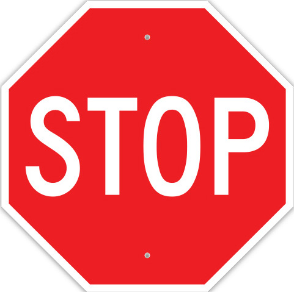
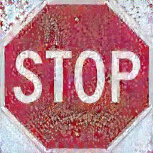

# advcam

代码和结果分别储存在AdvCam-Hide-Adv-with-Natural-Styles-master.zip和result.zip文件中。使用以下命令配置环境：
```sh
conda create -n advcam_env python=3.12
conda activate advcam_env
```
激活环境之后：
```sh
git clone https://github.com/Diodadadawryyyy/advcam.git
unzip AdvCam-Hide-Adv-with-Natural-Styles-master.zip
cd AdvCam-Hide-Adv-with-Natural-Styles-master
pip install --user --requirement requirements.txt
```
使用advcam.py生成对抗图片，修改其中的图片路径来更改内容图像和风格图像：
```python
content_image_path = 'physical-attack-data\\content\\1\\5.jpeg'

style_image_path = 'physical-attack-data\\style\\oil-painting\\1.jpg'
```
修改target值来更改目标图像。


使用attackvgg19.py来测试生成的图像，更改图像路径来改变测试图像：
```python
image_dir = 'output\\dog1\\suc_251.jpg'
```

原始图片与生成的对抗图片对比如下：
<p align='center'>
  
  
</p>
